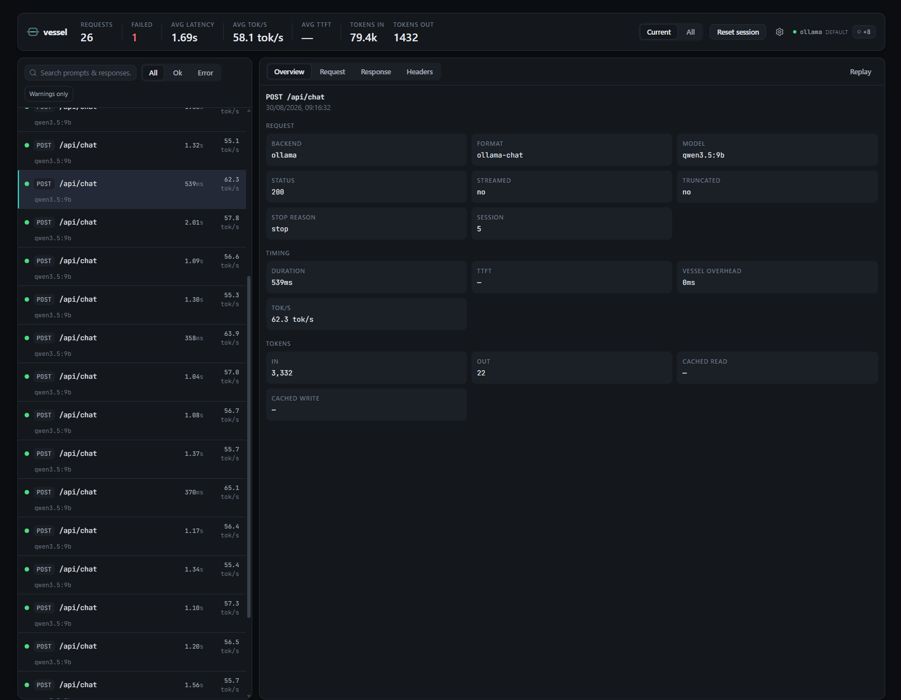

# vessel

> The lightweight, local-first observability proxy for LLM traffic. Point a client’s
> `base_url` at one small binary and get capture, search, metrics, replay, Compare, and
> a private UI—without sending prompts to a third party.



## Quickstart

1. Download the archive for your OS from [Releases](https://github.com/spenceclark/Vessel/releases), extract it, and run `vessel` (or `vessel.exe`). A first run creates the config and opens `http://127.0.0.1:4550/vessel/`.
   The default backend is Ollama on `localhost:11434`; if nothing is listening there, that first run opens on the backend picker so you can add OpenAI, Claude, or another backend straight away.
2. Point a client at Vessel. Your first request appearing in the UI means it worked.

```bash
# Ollama CLI
OLLAMA_HOST=127.0.0.1:4550 ollama run llama3.2

# OpenAI SDK — use base_url="http://127.0.0.1:4550/b/openai/v1"
# Anthropic SDK — use base_url="http://127.0.0.1:4550/b/anthropic"

# curl (Ollama-native)
curl http://127.0.0.1:4550/api/chat -d '{"model":"llama3.2","messages":[{"role":"user","content":"hello"}],"stream":false}'
```

Vessel is a **foreground process**: its terminal is Vessel, so closing the terminal
stops capture. For always-on use, use your OS’s normal mechanism (Task Scheduler,
systemd, or launchd).

Unsigned first-run note: macOS 15+ (Sequoia) removed right-click → Open as a Gatekeeper
bypass, so first unblock the binary from Terminal:

```
xattr -d com.apple.quarantine ./vessel
```

If that doesn't work, `xattr -c ./vessel` clears all extended attributes. Alternatively,
use the GUI path: run `./vessel`, let it be blocked, then go to **System Settings →
Privacy & Security** and click **Open Anyway**, then run it again and click **Open**. On
Apple Silicon, if you still see `Killed: 9` after un-quarantining, ad-hoc-sign the binary
with `codesign -s - --force ./vessel`.

Windows may show SmartScreen, where **More info** then **Run anyway** is needed.
Signing/notarization is intentionally deferred.

## Features

- Captures and searches OpenAI Chat/Responses, Anthropic Messages, Ollama, and unknown
  traffic; live history, sessions/tags, filters, health, warnings, and themes.
- Replay and Compare direct replay pairs. Same wire format only in v0.1: OpenAI-compatible
  backends compare broadly; cross-provider transformations are deliberately not performed.
- Copy as curl and a read-only MCP endpoint (`/vessel/mcp`) for searches, request detail,
  stats, and sessions from your own AI tools.

## Routing and tags

Route any request to any configured backend — per request, with no client
reconfiguration. Any OpenAI-compatible server (LM Studio, llama.cpp, vLLM, …) is just
a backend entry away:

```bash
# by path — works with any client that can set a base URL
base_url = "http://127.0.0.1:4550/b/lmstudio/v1"

# by header — for your own code
curl http://127.0.0.1:4550/api/chat -H "X-Vessel-Backend: ollama" -d '...'
```

Tag requests to attribute traffic — for example, one tag per agent in a multi-agent
app — then filter, search, and compare by tag in the UI:

```bash
curl http://127.0.0.1:4550/api/chat -H "X-Vessel-Tags: DungeonMaster,run-42" -d '...'
# or the path form, for header-less clients:  /t/DungeonMaster/api/chat
```

Assign a request to a named run with `X-Vessel-Session` (created on first use). This
does not change the Reset-driven session used by headerless traffic:

```bash
curl http://127.0.0.1:4550/api/chat -H "X-Vessel-Session: run-42" -d '...'
```

Session names are limited to 128 characters, and named sessions are capped at 500
markers: at that cap, requests for unseen names are captured in the current session,
while existing named sessions continue to work. (Reset-created markers are not subject
to this cap.)

Both compose: `/b/ollama/t/planner/api/chat`. Routing precedence is `/b/{backend}/…`,
then `X-Vessel-Backend`, then the default backend. Vessel strips its own `X-Vessel-*`
headers before forwarding — backends never see them.

## Query your traffic from AI tools (MCP)

Vessel serves a read-only [MCP](https://modelcontextprotocol.io) endpoint, so tools
like Claude Code can search and inspect your captured traffic — "why did my planner
agent stall this afternoon?" answered by the agent querying Vessel directly:

```bash
claude mcp add --transport http --scope user vessel http://127.0.0.1:4550/vessel/mcp
```

`--scope user` makes it available in every project (omit it to register for the
current folder only). The endpoint exposes search, request detail, stats, and
sessions — read-only, and any MCP client you connect can read your captured prompts.
Disable it with `mcp.enabled: false`.

## Container / compose

For Docker users, the shipped [`compose.yaml`](compose.yaml) is the canonical setup:

```bash
docker compose up -d
```

It runs `ghcr.io/spenceclark/vessel`, persists state in `vessel-data`, and assumes Ollama
runs on the host. In Open WebUI, set `OLLAMA_BASE_URL=http://vessel:4550` when Open WebUI
runs in the same compose stack (use `http://localhost:4550` from a host-side Open WebUI);
the path is Open WebUI → Vessel → Ollama. For bare Docker, `host.docker.internal` is the
default backend host name (and is supplied by the compose file’s `host-gateway` mapping).

To run Ollama in the same compose stack, uncomment the commented service in
`compose.yaml`, then change Vessel’s backend `baseUrl` to `http://ollama:11434`.

## Configuration

`--config <path>` always wins. Otherwise, an existing `vessel.json` beside the executable
selects portable mode; a fresh download creates one under `%LOCALAPPDATA%\vessel-proxy`
(Windows), `~/.config/vessel-proxy` (Linux/XDG), or
`~/Library/Application Support/vessel-proxy` (macOS). `vessel.db` lives alongside it.
`vessel --help` prints the resolved paths.

<!-- config-fields: backends.authEnv backends.baseUrl backends.injectStreamUsage backends.type capture.maxBodyMb defaultBackend listen mcp.enabled retention.maxDbSizeMb retention.maxRequests timeouts.activitySeconds warnings.slowTtftMs -->

| Field | Meaning |
| --- | --- |
| `listen` | `host:port`; defaults to `127.0.0.1:4550` (or `0.0.0.0:4550` in a container). |
| `defaultBackend` | Backend name used when no route selector is supplied. |
| `backends.<name>.baseUrl` | Required HTTP(S) backend URL. |
| `backends.<name>.type` | `ollama`, `openai`, `anthropic`, or `auto`; informs parsing and replay. |
| `backends.<name>.injectStreamUsage` | For OpenAI backends, request exact streamed usage; off by default. |
| `backends.<name>.authEnv` | Optional process environment variable used only for replay credentials. |
| `timeouts.activitySeconds` | Maximum no-byte-movement interval (default `1800`). |
| `retention.maxRequests` / `retention.maxDbSizeMb` | Local history caps (defaults `10000` / `500`). |
| `capture.maxBodyMb` | Per-body capture cap (default `32`); forwarding is never truncated. |
| `warnings.slowTtftMs` | Slow-TTFT threshold; `0` disables it. |
| `mcp.enabled` | Enables the read-only MCP endpoint (default `true`). |

Example:

```json
{
  "listen": "127.0.0.1:4550",
  "defaultBackend": "ollama",
  "backends": {
    "ollama": { "baseUrl": "http://localhost:11434", "type": "ollama" },
    "openai": { "baseUrl": "https://api.openai.com", "type": "openai", "authEnv": "OPENAI_API_KEY" }
  }
}
```

## Replay auth

Vessel never stores keys. Replay reads the credential from the environment of the Vessel
process: `OPENAI_API_KEY` for OpenAI, `ANTHROPIC_API_KEY` for Anthropic, or the backend’s
`authEnv` name for another compatible backend.

## Privacy and data

Requests are forwarded **byte-for-byte** — Vessel never modifies traffic beyond
stripping its own `X-Vessel-*` control headers (the opt-in `injectStreamUsage` is the
single documented exception). Vessel’s own per-request overhead is measured and shown
on every request in the UI — typically around a millisecond.

`vessel.db` contains your prompts and responses, stored locally with compressed bodies.
Authorization headers are redacted at rest, and Vessel never stores API keys anywhere.
Vessel binds localhost by default; if you bind a non-loopback address, the UI and
startup log warn that people on the network may read captured prompts (and access MCP
when enabled). Keep retention caps appropriate, and use the UI’s Data panel to clear
history or bulk-delete non-current sessions; individual sessions can be deleted from the
session picker. To remove Vessel completely: delete the executable and the `vessel-proxy`
data folder — there is nothing else.

## Building from source

Requires .NET 10 and Node.js.

```bash
dotnet build Vessel.sln
dotnet test Vessel.sln
cd frontend && npm ci && npm test && npm run build && npm run lint
dotnet publish src/Vessel -c Release -r win-x64 --self-contained -p:PublishSingleFile=true
```

See [`docs/brief.md`](docs/brief.md) for the product overview,
[`docs/architecture.md`](docs/architecture.md) for the design, and
[`CONTRIBUTING.md`](CONTRIBUTING.md) to get involved. Vessel is licensed under
[MIT](LICENSE).
