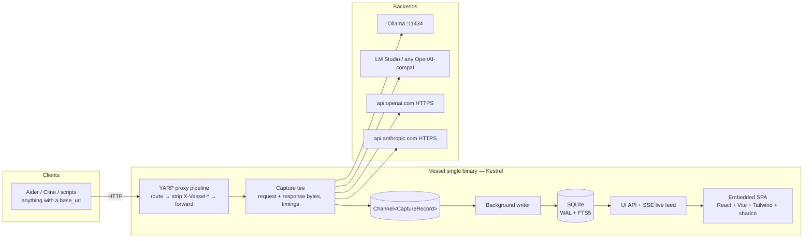

# Vessel — Architecture

> A lightweight, local-first observability reverse proxy for LLM traffic.
> Single binary. Point a `base_url` at it, get full request/response capture, metrics, and a UI.

Status: **implementation truth through Phase 5b** (proxy, capture, adapters, UI,
replay/compare, MCP) — companion to [brief.md](brief.md) and [plan.md](plan.md),
corrected in place as phases land. Phase 6 (ship) packages it without changing it.

---

## 1. Goals and non-goals

### Goals

- **Zero-config drop-in**: run one executable, change one `base_url`, everything works.
- **Forward-as-is**: Vessel never mutates proxied traffic, other than stripping its own
  `X-Vessel-*` control headers. What the client sent is what the backend receives.
- **Negligible overhead**: streaming pass-through is unbuffered; persistence happens on a
  background writer, never on the request path. Vessel measures and displays its own overhead.
- **Graceful degradation**: traffic Vessel doesn't understand is still proxied untouched and
  still captured (as raw bytes with timing). Unknown formats never break or drop a request.
- **Local and private**: binds to localhost by default; secrets are redacted at rest.

### Non-goals

- Not a load balancer, router-with-fallbacks, or API gateway (no retries, no key management,
  no quota enforcement).
- Not a hosted/multi-user service. One developer, one machine.
- No MITM / forward-proxy / SSL interception. Vessel is a **reverse proxy**: clients speak
  plain HTTP to localhost; Vessel makes its own outbound HTTPS connections to remote APIs as
  an ordinary TLS client.
- No prompt management, evals, or tracing SDK. Capture is purely at the wire level.

---

## 2. System overview



One process, three concerns:

1. **Proxy** — YARP on Kestrel forwards traffic to the selected backend, streaming.
2. **Capture** — a tee observes request/response bytes and timings, assembles a
   `CaptureRecord`, and drops it on a channel. Fire-and-forget from the request's view.
3. **Serve** — the same Kestrel host serves the UI SPA, a small REST API, and an SSE feed
   of live events, all under `/vessel/` so they can never collide with proxied API paths.

---

## 3. Proxy pipeline

### 3.1 Backends

A backend is `{ name, baseUrl, type }` where `type ∈ openai | anthropic | ollama | auto`
(a hint for format parsing and UI affordances, not a gate — parsing always sniffs the
actual payload). One backend is marked **default**. Configured in `vessel.json` and
editable in the UI (see §9).

### 3.2 Routing

**Control-plane reserves (never proxied, never captured):**
- `/vessel/*` — Vessel's own API and UI (D7).
- `/.well-known/oauth-authorization-server*`, `/.well-known/oauth-protected-resource*`,
  `/.well-known/openid-configuration*` — OAuth discovery probe paths per the MCP auth spec.
  Answered with `404 not_found` + `X-Vessel-Error` marking (D5). A backend that genuinely
  serves these paths remains reachable via `/b/{backend}/.well-known/…` (known edge).
- `/favicon.ico` — the embedded Vessel favicon in SVG format.

**Proxied traffic routing** (everything else):

1. **Path prefix**: `/b/{backend}/…` — e.g. `http://localhost:4550/b/openai/v1/chat/completions`.
   The prefix is stripped before forwarding. Works with clients that can only set a base URL.
2. **Header**: `X-Vessel-Backend: {backend}` — for developers' own code where adding a
   header is easy and the base URL should stay clean.
3. **Default backend**: anything else. This makes Vessel a literal drop-in for Ollama:
   point any Ollama client at `http://localhost:4550` and it just works.

Unknown backend name → `404` with a JSON error naming the valid backends (never silently
mis-route).

### 3.3 Tags

Free-form labels (e.g. agent name) that flow to the UI and are filterable:

- **Header**: `X-Vessel-Tags: planner,run-42` (comma-separated).
- **Path**: `/t/{tag}/…`, composable with backend prefix: `/b/ollama/t/planner/api/chat`.

### 3.3.1 Named sessions

`X-Vessel-Session: {name}` assigns only that request to the exact, case-sensitive
session name. The capture record carries the name to the single writer, which looks it
up or creates it on first sight before inserting the capture. This is never a process-wide
session switch: concurrent clients can use different names without interfering, while
headerless requests continue to use the Reset-driven current session. Blank or
whitespace-only values behave as if the header were absent. Replay deliberately remains
headerless and therefore lands in the current session.

### 3.4 Forward-as-is

- All request headers and the body are forwarded verbatim, **except** `X-Vessel-*` headers,
  which are stripped (they are Vessel's control plane, not payload). `Host` is rewritten to
  the backend's host, standard reverse-proxy behavior via YARP.
- `Authorization` / `x-api-key` pass through untouched — Vessel holds no keys of its own.
- Response bytes stream back to the client unbuffered, chunk by chunk.
- One deliberate, **opt-in, per-backend** exception: `injectStreamUsage` — for
  OpenAI-format backends, add `"stream_options": {"include_usage": true}` to streamed
  requests so exact token counts are reported. Default **off**; when off, missing counts
  are estimated and labeled as estimates (§5.4).

---

## 4. Streaming capture

The hardest part of the system; everything else is CRUD.

### 4.1 The tee

- **Request body**: buffered into the capture record as it is read (request bodies are not
  streamed by LLM clients in practice; they're a single JSON document).
- **Response body**: a pass-through stream wrapper. Every chunk is written to the client
  *first*, then appended to an in-memory capture buffer. No chunk is ever held back waiting
  on capture work.
- **Memory cap**: capture buffers are capped (default 32 MB per body). Beyond the cap the
  stored copy is truncated and flagged `truncated = true`; the proxied traffic itself is
  never truncated.

### 4.2 Timings

All timestamps from a monotonic clock (`Stopwatch`):

| Metric | Definition |
|---|---|
| `duration_ms` | first byte of request received → last byte of response sent |
| `ttft_ms` | request fully forwarded upstream → first response body byte from upstream. Streamed requests only; null otherwise. |
| `vessel_overhead_ms` | time spent in Vessel before the request is forwarded (routing, header work). Displayed in the UI — the "low overhead" claim, proven per-request. |
| `tok_per_sec` | output tokens ÷ (last byte − first byte of response), **streamed responses only**. For Ollama-native, prefer the exact `eval_count / eval_duration` it reports (streamed or not). A non-streamed non-Ollama response has no wire-span signal — total request duration mixes in queueing/prefill/network and is a different quantity, so it stays **null** rather than reporting that under the same metric name (code review D02). |

### 4.3 Stream reassembly

After the response completes, the capture buffer is parsed **off the request path** by the
background writer:

- **SSE** (`text/event-stream`): OpenAI-format `data:` deltas concatenated; Anthropic
  event types (`message_start`, `content_block_delta`, `message_delta`, …) folded into a
  final message. Usage, stop reason, and model are pulled from the final events.
- **NDJSON** (`application/x-ndjson`): Ollama-native chunks folded; the `done: true`
  object supplies `eval_count`, `prompt_eval_count`, `eval_duration`, `load_duration`,
  `total_duration` — exact metrics for free.
- Both the **reassembled message** and the **raw chunk stream** are stored, so the UI can
  show a clean response *and* the exact wire format when debugging streaming issues.

### 4.4 In-flight visibility

Capture emits lifecycle events onto the SSE feed: `hello` (connection identity),
`started`, `request_ready`, `first_token`, `completed`, and `cleared`. The UI shows
in-flight requests live with a running timer, plus a lightweight client-side detail
(method/path/backend/model/tags/elapsed — no REST fetch, since a request that hasn't
completed has no response to show yet).

**Lifecycle authority (code-review Batches H, I, J and K, R11/R23/R25/R26).** Recovery is a
snapshot plus an ordered log, not a set of merge rules. The SSE event id — allocated under the
hub's publish lock — is the single position for every lifecycle change, and
`GET /vessel/api/active` returns `{ active, logPosition, serverRunId }` read in that same
critical section: lifecycle truth *as of one stream position*. Each entry in `active` is a
descriptor — the `started` frame's own payload plus the parsed model — not a bare seq, so a
recovering client can *render* every request it is told is running, including one whose
`started` frame the lossy feed dropped. A request's `seq` is allocated inside the lock as it is
registered, so a seq can never exist unregistered and a snapshot can never omit one silently.
On reconnect, gap or run change the client rebuilds its in-flight rows from those descriptors
and discards everything it is holding at or below `logPosition` — queued frames, the completion
buffer, the lot — because a frame it received before issuing the request was published before
the snapshot was taken; frames above the position replay in order on top.
Between recoveries frames apply strictly in id order. `serverRunId` (a per-process GUID, also
on `hello` and `/status`) lets the client distinguish a restart from a reconnect and discard a
dead process's seqs and positions wholesale; only `hello` signals that change, since a
`/active` response carrying a different run id is merely stale and is discarded rather than
acted on. Every registered request is guaranteed a terminal transition — the writer completes
it, or (when capture admission is closed) `ProxyHandler` and the writer's drain do, and the
guarded span covers request preparation too — so a `seq` can never leak in the active set while
forwarding stays independent of capture health. Clearing is the in-band `cleared` event,
published under the same lock as `completed` so it orders correctly against them, and it
carries no payload for all/before clears; a session-scoped clear carries the exact
`sessionId` predicate. The client drops the matching cached rows and buffered completions at
that position and refetches, and REST reads remain authoritative. That
refetch cancels any outstanding list read first, because a pending initial fetch would
otherwise be reused rather than superseded, and its pre-clear snapshot would win. Earlier
rounds tried to ship the deletion *predicate* to the client (an id boundary, then a versioned
`{scope, beforeTs, boundaryId}`); both failed, because a client cannot re-derive which rows a
past deletion removed once ids are reused or a clear is missed. The UI applies the feed on a
~10 Hz coalescing window rather than per frame — at burst rates the per-frame path was a
main-thread/allocation hazard independent of ordering. Full contract in phase-3.md D5.

**Accepted scope (post-Phase-4 addition, code review E2).** `request_ready {seq, model}`
was added after Phase 3/4 landed (ui-spec.md §9.1's in-flight-detail TODO): emitted once
the request body has been fully read, with the model parsed off the request path by a
dedicated always-running consumer (`RequestModelSnifferService`), so an in-flight row
can show its real model within milliseconds of dispatch rather than only after
completion. Full contract in phase-3.md D5.

---

## 5. Format adapters

Adapters extract normalized fields from captured bodies. They run in the background writer,
never on the request path. Detection sniffs the URL path first, then payload shape — the
backend `type` is only a tiebreak hint.

| Adapter | Endpoints | Notes |
|---|---|---|
| **OpenAI chat** | `/v1/chat/completions` | Covers Ollama `/v1`, LM Studio, llama.cpp `llama-server`, Unsloth, OpenAI live. Usage in final chunk only with `stream_options.include_usage`. Cached tokens: `usage.prompt_tokens_details.cached_tokens`. |
| **OpenAI Responses** | `/v1/responses` | **Accepted scope, post-Phase-4 addition (code review E2).** A structurally different OpenAI API: request `input` (not `messages`), response `output[]` of typed items (`message`, `reasoning`, `function_call`, …) instead of `choices`. Streaming reassembly is simpler than chat completions — the terminal SSE event (`response.completed`/`.incomplete`/`.failed`) already carries the complete final response object, no delta-folding needed. Usage: `usage.input_tokens`/`usage.output_tokens`/`usage.input_tokens_details.cached_tokens`. `status`/`incomplete_details.reason` normalize onto the same stop-reason vocabulary the other adapters use (`length`, `error`, `stop`, …) so downstream truncation/error handling needs no format-specific branch. |
| **Anthropic messages** | `/v1/messages` | Anthropic live + Ollama's Anthropic-compat. Usage arrives in `message_start` + `message_delta`. Cache metrics: `cache_read_input_tokens`, `cache_creation_input_tokens`. |
| **Ollama native** | `/api/chat`, `/api/generate` | NDJSON streaming. Exact token counts and timings in the final object; `load_duration` distinguishes cold model loads from slow generation. Also capture `/api/embeddings`, `/api/tags`, etc. as raw. |
| **Raw fallback** | everything else | Method, path, status, timing, headers, raw bodies. Silent — proxied and listed normally, detail view shows raw bytes. |

### 5.1 Normalized fields

Every adapter produces the same record shape: `model`, `streamed`, `stop_reason`,
`tokens_in`, `tokens_out`, `tokens_cached_read`, `tokens_cached_write`, `prompt_text`,
`response_text` (flattened plain text for search/preview), plus structured `messages` and
`tool_calls` JSON for rich rendering.

### 5.2 Tool calls

`tool_calls` / `tool_use` / `tool_result` blocks are preserved structurally so the UI can
render them as collapsible cards (name, arguments, result) instead of raw JSON. Agent
traffic is mostly tool calls; this is a first-class rendering path, not an afterthought.

### 5.3 Warnings

Adapters attach warning flags used for UI badges:

- `stop_reason` is `length` / `max_tokens` — response was truncated.
- Non-2xx status, upstream connection failure, client disconnected mid-stream.
- Token counts estimated rather than reported.
- Anomalously high TTFT (threshold configurable; Ollama `load_duration` shown when it's
  the cause — "model was cold-loading" is the answer to half of all slow-request mysteries).

### 5.4 Token estimation

When a backend doesn't report usage (OpenAI-format streams without `include_usage`),
tokens are estimated (`chars/4` heuristic) and flagged `tokens_estimated = true`. The UI
renders estimates with a `~` prefix. Exact-when-available, honest-when-not.

---

## 6. Persistence

### 6.1 Engine and shape

**SQLite** via `Microsoft.Data.Sqlite`, WAL mode, `synchronous=NORMAL`. One database file
(default `vessel.db` next to the config). A single writer task consumes
`Channel<CaptureRecord>` (unbounded) and batches inserts in transactions (flush every
250 ms or 64 records). WAL lets UI reads proceed concurrently with writes.

### 6.2 Schema (v1)

```sql
CREATE TABLE requests (
    id                  INTEGER PRIMARY KEY,          -- rowid, insertion-ordered
    started_at          TEXT NOT NULL,                -- ISO-8601 UTC
    session_id          INTEGER REFERENCES sessions(id),
    backend             TEXT NOT NULL,
    tags                TEXT,                         -- JSON array
    method              TEXT NOT NULL,
    path                TEXT NOT NULL,
    format              TEXT NOT NULL,                -- openai-chat | openai-responses | anthropic-messages | ollama-chat | ollama-generate | raw
    model               TEXT,
    status_code         INTEGER,
    error               TEXT,                         -- proxy-level failure detail
    streamed            INTEGER NOT NULL DEFAULT 0,
    replay_of           INTEGER REFERENCES requests(id),
    -- metrics
    duration_ms         REAL,
    ttft_ms             REAL,
    vessel_overhead_ms  REAL,
    tok_per_sec         REAL,
    tokens_in           INTEGER,
    tokens_out          INTEGER,
    tokens_cached_read  INTEGER,
    tokens_cached_write INTEGER,
    tokens_estimated    INTEGER NOT NULL DEFAULT 0,
    stop_reason         TEXT,
    warnings            TEXT,                         -- JSON array of warning codes
    cost_estimate       REAL,
    -- payloads
    request_headers     TEXT NOT NULL,                -- JSON, redacted (§8)
    response_headers    TEXT,                         -- JSON
    request_body        BLOB,                         -- zstd-compressed
    response_body       BLOB,                         -- zstd, reassembled message
    response_raw        BLOB,                         -- zstd, raw chunk stream (streamed only)
    truncated           INTEGER NOT NULL DEFAULT 0
);
CREATE INDEX ix_requests_started ON requests(started_at);
CREATE INDEX ix_requests_session ON requests(session_id);

CREATE TABLE sessions (
    id          INTEGER PRIMARY KEY,
    started_at  TEXT NOT NULL,
    name        TEXT,
    is_current  INTEGER NOT NULL DEFAULT 0
);

-- full-text search over flattened prompt/response text
CREATE VIRTUAL TABLE requests_fts USING fts5(
    prompt_text, response_text, content='', contentless_delete=1
);
```

Bodies are **zstd-compressed** before insert (agent contexts reach 200K tokens and
compress ~10×). Flattened text goes only into FTS, not duplicated in `requests`.

**Known caveat (code review R14b, decided, not fixed here).** `id` is an ordinary SQLite
`INTEGER PRIMARY KEY` (plain ROWID allocation), not `AUTOINCREMENT` — after "clear all"
empties the table, the next inserted row can reuse a previously-deleted id. SQLite
explicitly distinguishes this from `AUTOINCREMENT`'s guaranteed non-reuse. A browser tab
with a detail view cached against the old id (React Query's `['request', id]`) could
therefore show a different capture's body under an id it already had open. Decision: no
schema migration for guaranteed non-reuse — that needs `AUTOINCREMENT` plus a rebuild
migration for existing databases, and the actual failure mode only reaches a **stale
already-open tab**, not a freshly-loaded one. The client-side fix instead: any clear
(all/before/session) evicts every cached `['request', *]` detail and clears the selection when
the clear reached it (ui-spec/App.tsx, code review R14a) — closing the practical exposure
without a migration. Revisit `AUTOINCREMENT` only if id reuse causes a real incident.

### 6.3 Sessions

A session is a marker row. "Reset session" inserts a new row, marks it as the one
Reset-driven current session, and headerless requests reference it. A named request
instead resolves its captured `X-Vessel-Session` name to an existing row (newest exact
match) or creates a non-current row on the single writer. Persisting `is_current` is
necessary because a named row may be newer without becoming the headerless default.
The UI session picker lists every marker newest-first (name plus id, with current
identified), pins Current and All, and shows the 15 most recent other sessions with
type-ahead over the full set. Each entry includes request count and relative last activity.
It scopes both history and the stats bar to the selected id; “All sessions” removes the
scope. `started` and recovery descriptors carry the exact session name while its id is
writer-unknown, so an existing named session can show its in-flight rows. The first request
for a brand-new name appears under All until its marker is inserted and the picker refreshes.
History is never lost by resetting or switching.

Retention and clear passes prune session markers with no remaining requests, except for
the current marker, which must remain a valid destination for headerless traffic.
Explicit session deletion is a scoped clear: `DELETE /vessel/api/sessions/{id}` removes
that non-current marker, all of its request rows, and matching FTS rows in one writer-thread
transaction. A replay in another session survives with `replay_of` cleared when its original
is deleted, preserving both the row and referential integrity. The current marker is rejected at execution time. Its ordered `cleared
{sessionId}` frame removes only that session from connected clients; the authoritative
refetch and snapshot recovery rules are otherwise unchanged.

### 6.4 Retention

Two independent, configurable caps, enforced by the writer after each batch:

- `maxRequests` (default 10 000) — delete oldest rows beyond the cap.
- `maxDbSizeMb` (default 500) — delete oldest rows until under the cap.

`PRAGMA auto_vacuum = INCREMENTAL` with periodic `incremental_vacuum` returns space
without blocking. The Data panel offers **Clear all**, **Clear before date**, and typed-confirmation
bulk deletion for selected non-current sessions. A single non-current picker row instead uses a
lightweight Delete/Cancel confirmation that shows its request count; current has no affordance.

---

## 7. UI API surface

Everything Vessel-owned lives under `/vessel/` (impossible to collide with `/v1/…` or
`/api/…` proxied paths):

| Route | Purpose |
|---|---|
| `GET /vessel/` | embedded SPA |
| `GET /vessel/api/requests` | paged list; filters: text (FTS), backend, model, tag, status, format, session, has-warning |
| `GET /vessel/api/requests/{id}` | full detail, bodies decompressed |
| `POST /vessel/api/requests/{id}/replay` | re-send captured request; body may override `backend` and/or `model`; result is a new request row with `replay_of` set |
| `GET /vessel/api/requests/{id}/replays` | direct replay children, for Compare entry points |
| `GET /vessel/api/sessions` · `POST /vessel/api/sessions` | newest-first list (`isCurrent`, request count, last-request time) / reset (create + activate marker) |
| `DELETE /vessel/api/sessions/{id}` | delete one non-current session marker with all request + FTS rows as a writer-scoped clear |
| `GET /vessel/api/stats?session=` | totals, failures, avg latency / tok/s / ttft, token totals in/out/cached (accepted scope, post-Phase-4 addition — phase-3.md D3) |
| `GET /vessel/api/events` | SSE lifecycle feed: `hello`, `started`, `request_ready`, `first_token`, `completed`, `cleared` (§4.4) |
| `GET /vessel/api/active` | recovery snapshot `{ active, logPosition, serverRunId }` — the in-flight requests as displayable descriptors, and the log position that set is true as of (§4.4, Batch F/H/I/J/K) |
| `GET/PUT /vessel/api/config` | backends, retention, ports, redaction — persisted to `vessel.json` |
| `GET /vessel/api/ollama/ps` | (Ollama backends) proxied `ollama ps` — loaded models, memory |
| `GET /vessel/api/status` | server status: version, effective listen address, per-backend passive health, `mcp.enabled`, first-run setup state (#11) |
| `POST /vessel/mcp` | read-only MCP server (official SDK, Streamable HTTP): `search_requests`, `get_request`, `get_stats`, `list_sessions` over the capture store; `mcp.enabled` kill-switch, live-applied (phase-5b) |

Replay is an internal request to Vessel's own `/b/{backend}/…` route, so it follows the
normal proxy/capture pipeline. It sends only Content-Type, optional Accept, Vessel control
headers and target auth — never stored headers. Local no-auth targets omit auth. Remote
OpenAI-style targets use `Authorization: Bearer $OPENAI_API_KEY`; Anthropic targets use
`x-api-key: $ANTHROPIC_API_KEY` plus `anthropic-version`. An optional per-backend `authEnv`
names a different process environment variable; no secret is stored in config or the database.
Copy-as-curl is generated client-side from the detail payload and targets Vessel, with the
same environment-variable placeholders. There is deliberately no server-side curl endpoint;
`GET /vessel/api/requests/{id}/replays` is the only Phase 5 request-child read route.

---

## 8. Security & privacy

- **Bind localhost** (`127.0.0.1`) by default. Binding `0.0.0.0` requires an explicit
  config change and shows a persistent banner in the UI.
- **Redaction at rest**: `Authorization`, `x-api-key`, `api-key`, `cookie`,
  `proxy-authorization` are stored as scheme + last 4 chars, e.g.
  `Bearer …-Ab4x` — recognizable for debugging, useless if leaked. Redaction happens
  *before* the record enters the channel; plaintext secrets never reach the writer or DB.
  Forwarding is unaffected (redaction applies to the stored copy only).
- Bodies are stored in full by design (that's the product). The README will say so
  plainly: `vessel.db` contains your prompts — treat it accordingly.
- **Browser-origin threat model (D03, resolved).** Loopback binding alone doesn't stop a
  page open in the user's browser from reaching Vessel: an attacker page (or one reached
  via DNS rebinding to a loopback-resolving name) can still have the victim's browser
  issue same-machine requests, and Kestrel does not validate `Host` on its own. Two cheap
  layers, scoped to the control plane only — every proxied route is untouched, so ordinary
  SDK traffic can never be broken by this:
  - `/vessel/*` (both the API and the embedded UI) requires a `Host` that is loopback
    (`localhost`, `127.0.0.1`, `::1`) or the configured `listen` address — a mismatched
    `Host` is `403 forbidden_host`. This is what closes the rebinding path itself.
  - Mutating `/vessel/api/*` requests (`PUT`/`POST`/`DELETE`) additionally require
    same-origin: `Sec-Fetch-Site: same-origin` or `none` where a browser sends it,
    otherwise an `Origin` match against the request's own scheme+host+port. A request
    with neither header (curl, scripts, the SDK, the test suite) isn't a browser
    interaction at all and is let through — this stops a same-Host-but-cross-site page
    from issuing state-changing requests via the victim's browser, without requiring UI
    authentication. Implementation: `Api/HostOriginGuard.cs`, wired as middleware in
    `VesselApp.Build` ahead of the `/vessel/*` route mappings.
  - This is explicitly **not** UI authentication and **not** the Phase 6 non-loopback
    bind-address banner (still open, tracked separately) — it only closes the specific
    browser-reachable gap the review identified.
- **MCP shares this boundary — stated plainly (phase-5b D5).** `/vessel/mcp` sits
  behind the same loopback bind + Host guard with no additional auth, which means
  **any MCP client you connect can read your captured prompts**. `mcp.enabled`
  (default on, live-applied) is the kill-switch; the README and the non-loopback
  bind banner (phase-6 D6) carry the user-facing statement.

---

## 9. Configuration

`vessel.json` beside the executable (created on first run with an Ollama default), also
editable in the UI:

```jsonc
{
  "listen": "127.0.0.1:4550",
  "defaultBackend": "ollama",
  "backends": {
    "ollama":    { "baseUrl": "http://localhost:11434", "type": "ollama" },
    "lmstudio":  { "baseUrl": "http://localhost:1234",  "type": "openai" },
    "unsloth":   { "baseUrl": "http://localhost:8888",  "type": "openai" },
    "llamacpp":  { "baseUrl": "http://localhost:8080",  "type": "openai" },
    "vllm":      { "baseUrl": "http://localhost:8000",  "type": "openai" },
    "lemonade":  { "baseUrl": "http://localhost:13305", "type": "openai" },
    "openai":    { "baseUrl": "https://api.openai.com", "type": "openai", "authEnv": "OPENAI_API_KEY" },
    "anthropic": { "baseUrl": "https://api.anthropic.com", "type": "anthropic", "authEnv": "ANTHROPIC_API_KEY" },
    "gemini":    { "baseUrl": "https://generativelanguage.googleapis.com/v1beta/openai", "type": "openai", "authEnv": "GEMINI_API_KEY" }
  },
  "timeouts":  { "activitySeconds": 1800 },
  "retention": { "maxRequests": 10000, "maxDbSizeMb": 500 },
  "capture":   { "maxBodyMb": 32 },
  "warnings":  { "slowTtftMs": 5000 },
  "mcp":       { "enabled": true },
  "pricing":   {}   // reserved for Phase 7 cost estimates; not read by this binary yet (unknown fields are preserved on save)
}
```

The block above lists every backend Vessel recognises; a newly created config contains only the Ollama backend, which stays the default (Phase 5 PD1).
The run that *creates* that config — and no later run — makes a single TCP connect to the default backend's host and port to answer "is anything actually there?", and reports it on `/vessel/api/status` as `setup {firstRun, defaultBackendReachable}` (#11). It sends zero bytes, is skipped for any host that isn't loopback or private (§8's own rule, so it can never reach a paid API), and is kept out of the passive health dots entirely. Reachable is today's silent zero-config drop-in, unchanged; unreachable is what makes the UI lead with the backend picker instead of leaving a cloud-only visitor to discover the dead default through a `502 upstream_unreachable`.
`type: openai` means OpenAI-compatible wire format, not OpenAI-hosted. Unsloth Desktop requires an API
key created in its UI, but does not define an environment-variable name for it; configure
`authEnv` yourself if Vessel should re-attach that key for replay. LM Studio, llama.cpp,
vLLM, and Lemonade are unauthenticated by default; each can be configured to require a key
by its own server settings. Gemini's OpenAI compatibility endpoint uses Bearer
`GEMINI_API_KEY` (Google also supports `GOOGLE_API_KEY`, which takes precedence in its own
SDKs).

| Backend | Default endpoint | Wire format | Authentication at default | Auth environment variable when enabled/required |
| --- | --- | --- | --- | --- |
| Ollama | `http://localhost:11434` | Ollama native | none | — |
| LM Studio | `http://localhost:1234` | OpenAI-compatible | none | `LM_API_TOKEN` if API-token auth is enabled |
| Unsloth Desktop | `http://localhost:8888` | OpenAI-compatible | required | none; create the key in Unsloth Desktop and choose an `authEnv` name in Vessel if replay needs it |
| llama.cpp `llama-server` | `http://localhost:8080` | OpenAI-compatible | none | `LLAMA_ARG_API_KEY` if API-key auth is enabled |
| vLLM | `http://localhost:8000` | OpenAI-compatible | none | `VLLM_API_KEY` if API-key auth is enabled |
| Lemonade | `http://localhost:13305` | OpenAI-compatible | none | `LEMONADE_API_KEY` if API-key auth is enabled |
| OpenAI | `https://api.openai.com` (443) | OpenAI | required | `OPENAI_API_KEY` |
| Anthropic | `https://api.anthropic.com` (443) | Anthropic Messages | required | `ANTHROPIC_API_KEY` |
| Gemini | `https://generativelanguage.googleapis.com/v1beta/openai` (443) | OpenAI-compatible | required | `GEMINI_API_KEY` (`GOOGLE_API_KEY` also supported) |

### 9.1 Live apply (Phase 4)

`GET`/`PUT /vessel/api/config` are backed by a `ConfigStore` singleton: a single
`ConfigSnapshot(VesselConfig Config, int Version)` record — config and its revision number
published together as *one* immutable reference, behind a single `Volatile.Read`/`Write`.
`PUT` validates the candidate with the exact same rules `ConfigLoader` applies at startup
(a bad config → `400` with the human validation message, nothing persisted or applied),
then writes `vessel.json` and swaps in a new `ConfigSnapshot` carrying both the new config
and the bumped version — serialized under a lock, last write wins (single user, single
machine).

**Finding (code review R02, resolved) — config and version must be one reference, not
two.** An earlier design published the config and a version counter as separate fields.
A `PUT` landing between a consumer's two reads could label a map built from revision N as
revision N+1, and the consumer would then treat that stale map as current until the *next*
`PUT` — routing (and that request's timeouts/body-size limits) could stay silently wrong
indefinitely. Publishing both in one `ConfigSnapshot` reference makes that interleaving
unrepresentable: there is no way to observe the version without the config it actually
belongs to. Every derived cache follows the same rule — it's built from, and keyed by
reference to, one specific `ConfigSnapshot`, never from a version number compared
separately from the config that produced it:

- `BackendRegistry.Resolve(ConfigSnapshot)` returns the `BackendSet` (name → backend map
  plus the resolved default, also one bundled value so those two can't disagree either)
  for *exactly* the snapshot passed in — not "whatever's newest by the time a rebuild lock
  is free." A caller that resolves routing and per-request limits from the same snapshot
  (below) is guaranteed both come from the same revision. An internal `_current` fast-path
  cache still only ever advances to a newer snapshot opportunistically, as a read-through
  optimization for callers with no request-scoped snapshot of their own (`Latest`, used by
  `/vessel/api/status` and the startup banner) — it never regresses to an older entry, and
  it never substitutes for the snapshot a caller explicitly asked to resolve.
- `ProxyHandler.Handle` reads `ConfigStore.Snapshot` exactly once per request and uses that
  same reference for both `BackendRegistry.Resolve` (routing, via `RouteResolver.Resolve`,
  which takes an already-resolved `BackendSet` rather than the registry) and this request's
  `Capture.MaxBodyMb`/`Timeouts.ActivitySeconds` — so a `PUT` racing mid-request can never
  apply revision N's limits to revision N+1's backend or vice versa.
- `FormatEnricher` re-derives its backend-type map and slow-TTFT threshold when the
  snapshot reference it was built from is no longer the store's current one.
- The writer (`SqliteCaptureStore.EnforceRetention`) re-reads retention caps every batch
  from the current snapshot, so a tightened cap takes effect on the next flush, not the
  next restart.

`ConfigSnapshotConcurrencyTests` pins this under load (interleaved `PUT` + resolve loops
asserting a lookup never returns backends from a revision other than the snapshot it was
resolved against); a regression where the registry's rebuild path substituted "whatever
was newest" for the caller's requested snapshot was caught by this exact test failing
deterministically across repeated full-suite runs, and fixed in `BackendRegistry.Resolve`
as described above.

**Finding (code review R16, resolved).** `restartRequired` compared the PUT candidate's
`listen` against whatever was *last saved*, not against the address Kestrel is actually
bound to. Only `listen` needs a restart to take effect, so a second save of the same
listener value reported `restartRequired: []` — "no restart needed" — even though the
process was still serving on its old address, because the *saved* value had already
caught up on the first save. `ConfigStore.RecordBoundListen` now records the real bound
`(address, port)` once, right after Kestrel starts (the configured `listen` may have been
port `0`); every `Apply` and a new read-only `ConfigStore.PendingRestart` compare against
that fixed point instead. `GET /vessel/api/config` now returns
`{ config, restartRequired }` (not a bare `VesselConfig`) so the settings panel shows the
still-pending state on reopen, not just immediately after a `PUT` — the previous shape
only surfaced it as ephemeral component state that a panel close/reopen lost.

**`listen` is the one field that doesn't apply live** — `PUT` still validates and persists
it, and the response reports `restartRequired: ["listen"]` so the UI can banner it; Kestrel
keeps serving on the address it already bound.

In-flight requests are unaffected by a concurrent `PUT`: `RouteResolver.Resolve` runs once
at the top of `ProxyHandler.Handle`, and the resulting `RouteDecision` (holding its own
resolved `ResolvedBackend`) is what the rest of the request uses — removing or repointing
that backend mid-flight never aborts traffic already in progress to it.

---

## 10. Frontend

**React + Vite + TypeScript + Tailwind + shadcn/ui**, built to static files and embedded
in the binary as resources (`ManifestEmbeddedFileProvider`). No Node needed at runtime;
`dotnet publish` runs `vite build` as a pre-step.

State/data: TanStack Query for the REST API, an `EventSource` hook merging SSE events
into the list. TanStack Virtual for the history list (10k rows must scroll smoothly).

### Views

- **Header bar** — selected-session stats (requests, failures, avg latency, avg tok/s,
  avg TTFT), newest-first session picker, Reset Session, backend health dots.
- **History list** (left) — reverse-chronological, virtualized, live. Row: path, model,
  duration, tok/s, tags, warning badge. Filter bar: free text (FTS), backend, model, tag,
  status, warnings-only.
- **Detail pane** (right) — tabs:
  - *Overview*: metrics incl. TTFT, Vessel overhead, cache read/write tokens, rate-limit
    headers (`x-ratelimit-*`, `anthropic-ratelimit-*`) when present, warnings, cost estimate.
  - *Request*: rendered messages (system/user/assistant), tool definitions; raw JSON toggle.
  - *Response*: rendered message, tool calls as cards; raw + raw-stream toggles.
  - *Headers*: request/response, redacted values marked.
  - Actions: **Replay** (backend/model picker), **Copy as curl**, **Diff** (pick a second
    request → side-by-side message diff).
- **Ollama panel** (when an Ollama backend exists) — `ollama ps` (loaded models, VRAM),
  server.log viewer (later phase).

---

## 11. Project layout & packaging

```
Vessel.sln
src/Vessel/            # single ASP.NET Core project: proxy + capture + API + embedded UI
  Proxy/               # YARP config, routing, tee streams
  Capture/             # CaptureRecord, channel, background writer
  Formats/             # IFormatAdapter + OpenAI/Anthropic/Ollama/Raw
  Storage/             # SQLite, schema migrations, retention
  Api/                 # /vessel/api endpoints + SSE
frontend/              # Vite app → dist embedded at publish
tests/Vessel.Tests/    # adapter fixtures (recorded wire captures), tee/timing tests
```

Distribution: `dotnet publish -c Release --self-contained -p:PublishSingleFile=true`
per RID (win-x64, linux-x64, osx-arm64, osx-x64) → one ~30 MB executable, no runtime
install. Trimming enabled once the dependency set is stable; Native AOT is a later
experiment, not a requirement.

---

## 12. Key decisions (mini-ADR)

| Decision | Choice | Why | Rejected |
|---|---|---|---|
| Proxy model | Reverse proxy | Every SDK supports base_url override; no cert trust issues | MITM forward proxy |
| Backend | .NET 10 + YARP + Kestrel | Author fluency; YARP does streaming reverse-proxying natively; self-contained publish removes runtime objection | Go/Rust (AI-mediated maintenance), Node (runtime) |
| Storage | SQLite WAL + FTS5 + zstd bodies | Query/filter/search/caps for free; single-writer sidesteps contention | JSONL (no query/caps), DuckDB (wrong shape for row appends) |
| Persistence path | `Channel<T>` + background writer | Zero request-path cost; natural batching | Write-on-request, fire-and-forget tasks per request |
| Frontend | Embedded React SPA | Server already exists; richest AI-assisted ecosystem | Electron (heavy, second app), htmx (weak fit for virtualized live lists) |
| Routing | Path prefix **and** header, plus default | Headers for dev code; paths for base_url-only clients; default = drop-in Ollama replacement | Header-only |
| Live formats v1 | OpenAI chat, Anthropic messages, Ollama native | Covers the author's actual usage + all listed targets; llama.cpp/LM Studio/Unsloth ride the OpenAI adapter | llama.cpp native (its server is OpenAI-compat anyway) |
| Unknown traffic | Proxy + capture as raw, silently | A proxy that breaks unknown traffic is worse than none | Reject/warn |
