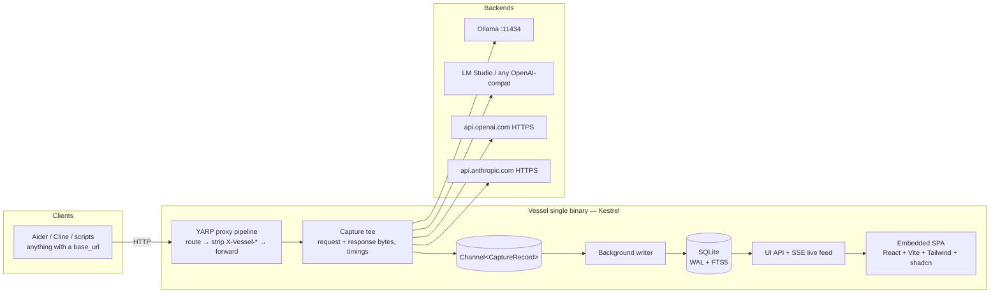

# Vessel — Architecture

> A lightweight, local-first observability reverse proxy for LLM traffic.
> Single binary. Point a `base_url` at it, get full request/response capture, metrics, and a UI.

Status: **draft, pre-implementation** — companion to [brief.md](brief.md) and [plan.md](plan.md).

---

## 1. Goals and non-goals

### Goals

- **Zero-config drop-in**: run one executable, change one `base_url`, everything works.
- **Forward-as-is**: Vessel never mutates proxied traffic, other than stripping its own
  `X-Vessel-*` control headers. What the client sent is what the backend receives.
- **Negligible overhead**: streaming pass-through is unbuffered; persistence happens on a
  background writer, never on the request path. Vessel measures and displays its own overhead.
- **Graceful degradation**: traffic Vessel doesn't understand is still proxied untouched and
  still captured (as raw bytes with timing). Unknown formats never break or drop a request.
- **Local and private**: binds to localhost by default; secrets are redacted at rest.

### Non-goals

- Not a load balancer, router-with-fallbacks, or API gateway (no retries, no key management,
  no quota enforcement).
- Not a hosted/multi-user service. One developer, one machine.
- No MITM / forward-proxy / SSL interception. Vessel is a **reverse proxy**: clients speak
  plain HTTP to localhost; Vessel makes its own outbound HTTPS connections to remote APIs as
  an ordinary TLS client.
- No prompt management, evals, or tracing SDK. Capture is purely at the wire level.

---

## 2. System overview



One process, three concerns:

1. **Proxy** — YARP on Kestrel forwards traffic to the selected backend, streaming.
2. **Capture** — a tee observes request/response bytes and timings, assembles a
   `CaptureRecord`, and drops it on a channel. Fire-and-forget from the request's view.
3. **Serve** — the same Kestrel host serves the UI SPA, a small REST API, and an SSE feed
   of live events, all under `/vessel/` so they can never collide with proxied API paths.

---

## 3. Proxy pipeline

### 3.1 Backends

A backend is `{ name, baseUrl, type }` where `type ∈ openai | anthropic | ollama | auto`
(a hint for format parsing and UI affordances, not a gate — parsing always sniffs the
actual payload). One backend is marked **default**. Configured in `vessel.json` and
editable in the UI (see §9).

### 3.2 Routing

Requests are routed in this precedence order:

1. **Path prefix**: `/b/{backend}/…` — e.g. `http://localhost:4550/b/openai/v1/chat/completions`.
   The prefix is stripped before forwarding. Works with clients that can only set a base URL.
2. **Header**: `X-Vessel-Backend: {backend}` — for developers' own code where adding a
   header is easy and the base URL should stay clean.
3. **Default backend**: anything else. This makes Vessel a literal drop-in for Ollama:
   point any Ollama client at `http://localhost:4550` and it just works.

Unknown backend name → `404` with a JSON error naming the valid backends (never silently
mis-route).

### 3.3 Tags

Free-form labels (e.g. agent name) that flow to the UI and are filterable:

- **Header**: `X-Vessel-Tags: planner,run-42` (comma-separated).
- **Path**: `/t/{tag}/…`, composable with backend prefix: `/b/ollama/t/planner/api/chat`.

### 3.4 Forward-as-is

- All request headers and the body are forwarded verbatim, **except** `X-Vessel-*` headers,
  which are stripped (they are Vessel's control plane, not payload). `Host` is rewritten to
  the backend's host, standard reverse-proxy behavior via YARP.
- `Authorization` / `x-api-key` pass through untouched — Vessel holds no keys of its own.
- Response bytes stream back to the client unbuffered, chunk by chunk.
- One deliberate, **opt-in, per-backend** exception: `injectStreamUsage` — for
  OpenAI-format backends, add `"stream_options": {"include_usage": true}` to streamed
  requests so exact token counts are reported. Default **off**; when off, missing counts
  are estimated and labeled as estimates (§5.4).

---

## 4. Streaming capture

The hardest part of the system; everything else is CRUD.

### 4.1 The tee

- **Request body**: buffered into the capture record as it is read (request bodies are not
  streamed by LLM clients in practice; they're a single JSON document).
- **Response body**: a pass-through stream wrapper. Every chunk is written to the client
  *first*, then appended to an in-memory capture buffer. No chunk is ever held back waiting
  on capture work.
- **Memory cap**: capture buffers are capped (default 32 MB per body). Beyond the cap the
  stored copy is truncated and flagged `truncated = true`; the proxied traffic itself is
  never truncated.

### 4.2 Timings

All timestamps from a monotonic clock (`Stopwatch`):

| Metric | Definition |
|---|---|
| `duration_ms` | first byte of request received → last byte of response sent |
| `ttft_ms` | request fully forwarded upstream → first response body byte from upstream. Streamed requests only; null otherwise. |
| `vessel_overhead_ms` | time spent in Vessel before the request is forwarded (routing, header work). Displayed in the UI — the "low overhead" claim, proven per-request. |
| `tok_per_sec` | output tokens ÷ (last byte − first byte of response). For Ollama-native, prefer the exact `eval_count / eval_duration` it reports. |

### 4.3 Stream reassembly

After the response completes, the capture buffer is parsed **off the request path** by the
background writer:

- **SSE** (`text/event-stream`): OpenAI-format `data:` deltas concatenated; Anthropic
  event types (`message_start`, `content_block_delta`, `message_delta`, …) folded into a
  final message. Usage, stop reason, and model are pulled from the final events.
- **NDJSON** (`application/x-ndjson`): Ollama-native chunks folded; the `done: true`
  object supplies `eval_count`, `prompt_eval_count`, `eval_duration`, `load_duration`,
  `total_duration` — exact metrics for free.
- Both the **reassembled message** and the **raw chunk stream** are stored, so the UI can
  show a clean response *and* the exact wire format when debugging streaming issues.

### 4.4 In-flight visibility

Capture emits three lifecycle events onto the SSE feed: `started`, `first-token`,
`completed`. The UI shows in-flight requests live with a running timer.

---

## 5. Format adapters

Adapters extract normalized fields from captured bodies. They run in the background writer,
never on the request path. Detection sniffs the URL path first, then payload shape — the
backend `type` is only a tiebreak hint.

| Adapter | Endpoints | Notes |
|---|---|---|
| **OpenAI chat** | `/v1/chat/completions` | Covers Ollama `/v1`, LM Studio, llama.cpp `llama-server`, Unsloth, OpenAI live. Usage in final chunk only with `stream_options.include_usage`. Cached tokens: `usage.prompt_tokens_details.cached_tokens`. |
| **Anthropic messages** | `/v1/messages` | Anthropic live + Ollama's Anthropic-compat. Usage arrives in `message_start` + `message_delta`. Cache metrics: `cache_read_input_tokens`, `cache_creation_input_tokens`. |
| **Ollama native** | `/api/chat`, `/api/generate` | NDJSON streaming. Exact token counts and timings in the final object; `load_duration` distinguishes cold model loads from slow generation. Also capture `/api/embeddings`, `/api/tags`, etc. as raw. |
| **Raw fallback** | everything else | Method, path, status, timing, headers, raw bodies. Silent — proxied and listed normally, detail view shows raw bytes. |

### 5.1 Normalized fields

Every adapter produces the same record shape: `model`, `streamed`, `stop_reason`,
`tokens_in`, `tokens_out`, `tokens_cached_read`, `tokens_cached_write`, `prompt_text`,
`response_text` (flattened plain text for search/preview), plus structured `messages` and
`tool_calls` JSON for rich rendering.

### 5.2 Tool calls

`tool_calls` / `tool_use` / `tool_result` blocks are preserved structurally so the UI can
render them as collapsible cards (name, arguments, result) instead of raw JSON. Agent
traffic is mostly tool calls; this is a first-class rendering path, not an afterthought.

### 5.3 Warnings

Adapters attach warning flags used for UI badges:

- `stop_reason` is `length` / `max_tokens` — response was truncated.
- Non-2xx status, upstream connection failure, client disconnected mid-stream.
- Token counts estimated rather than reported.
- Anomalously high TTFT (threshold configurable; Ollama `load_duration` shown when it's
  the cause — "model was cold-loading" is the answer to half of all slow-request mysteries).

### 5.4 Token estimation

When a backend doesn't report usage (OpenAI-format streams without `include_usage`),
tokens are estimated (`chars/4` heuristic) and flagged `tokens_estimated = true`. The UI
renders estimates with a `~` prefix. Exact-when-available, honest-when-not.

---

## 6. Persistence

### 6.1 Engine and shape

**SQLite** via `Microsoft.Data.Sqlite`, WAL mode, `synchronous=NORMAL`. One database file
(default `vessel.db` next to the config). A single writer task consumes
`Channel<CaptureRecord>` (unbounded) and batches inserts in transactions (flush every
250 ms or 64 records). WAL lets UI reads proceed concurrently with writes.

### 6.2 Schema (v1)

```sql
CREATE TABLE requests (
    id                  INTEGER PRIMARY KEY,          -- rowid, insertion-ordered
    started_at          TEXT NOT NULL,                -- ISO-8601 UTC
    session_id          INTEGER REFERENCES sessions(id),
    backend             TEXT NOT NULL,
    tags                TEXT,                         -- JSON array
    method              TEXT NOT NULL,
    path                TEXT NOT NULL,
    format              TEXT NOT NULL,                -- openai-chat | anthropic-messages | ollama-chat | ollama-generate | raw
    model               TEXT,
    status_code         INTEGER,
    error               TEXT,                         -- proxy-level failure detail
    streamed            INTEGER NOT NULL DEFAULT 0,
    replay_of           INTEGER REFERENCES requests(id),
    -- metrics
    duration_ms         REAL,
    ttft_ms             REAL,
    vessel_overhead_ms  REAL,
    tok_per_sec         REAL,
    tokens_in           INTEGER,
    tokens_out          INTEGER,
    tokens_cached_read  INTEGER,
    tokens_cached_write INTEGER,
    tokens_estimated    INTEGER NOT NULL DEFAULT 0,
    stop_reason         TEXT,
    warnings            TEXT,                         -- JSON array of warning codes
    cost_estimate       REAL,
    -- payloads
    request_headers     TEXT NOT NULL,                -- JSON, redacted (§8)
    response_headers    TEXT,                         -- JSON
    request_body        BLOB,                         -- zstd-compressed
    response_body       BLOB,                         -- zstd, reassembled message
    response_raw        BLOB,                         -- zstd, raw chunk stream (streamed only)
    truncated           INTEGER NOT NULL DEFAULT 0
);
CREATE INDEX ix_requests_started ON requests(started_at);
CREATE INDEX ix_requests_session ON requests(session_id);

CREATE TABLE sessions (
    id          INTEGER PRIMARY KEY,
    started_at  TEXT NOT NULL,
    name        TEXT
);

-- full-text search over flattened prompt/response text
CREATE VIRTUAL TABLE requests_fts USING fts5(
    prompt_text, response_text, content='', contentless_delete=1
);
```

Bodies are **zstd-compressed** before insert (agent contexts reach 200K tokens and
compress ~10×). Flattened text goes only into FTS, not duplicated in `requests`.

### 6.3 Sessions

A session is a marker row, nothing more. "Reset session" inserts a new `sessions` row;
subsequent requests reference it; the session stats bar aggregates
`WHERE session_id = current`. History across old sessions is preserved and browsable.

### 6.4 Retention

Two independent, configurable caps, enforced by the writer after each batch:

- `maxRequests` (default 10 000) — delete oldest rows beyond the cap.
- `maxDbSizeMb` (default 500) — delete oldest rows until under the cap.

`PRAGMA auto_vacuum = INCREMENTAL` with periodic `incremental_vacuum` returns space
without blocking. UI offers **Clear all** and **Clear before date**.

---

## 7. UI API surface

Everything Vessel-owned lives under `/vessel/` (impossible to collide with `/v1/…` or
`/api/…` proxied paths):

| Route | Purpose |
|---|---|
| `GET /vessel/` | embedded SPA |
| `GET /vessel/api/requests` | paged list; filters: text (FTS), backend, model, tag, status, format, session, has-warning |
| `GET /vessel/api/requests/{id}` | full detail, bodies decompressed |
| `POST /vessel/api/requests/{id}/replay` | re-send captured request; body may override `backend` and/or `model`; result is a new request row with `replay_of` set |
| `GET /vessel/api/requests/{id}/curl` | request as a copy-pasteable curl command |
| `GET /vessel/api/sessions` · `POST /vessel/api/sessions` | list / reset (create marker) |
| `GET /vessel/api/stats?session=` | totals, failures, avg latency / tok/s / ttft |
| `GET /vessel/api/events` | SSE: `started`, `first-token`, `completed` lifecycle events |
| `GET/PUT /vessel/api/config` | backends, retention, ports, redaction — persisted to `vessel.json` |
| `GET /vessel/api/ollama/ps` | (Ollama backends) proxied `ollama ps` — loaded models, memory |

Replay uses stored redacted headers **minus** auth (§8); auth is re-attached only from a
live pass-through toggle the user sets per-backend, or the replay is sent without auth
(fine for local backends, which is the primary replay use case).

---

## 8. Security & privacy

- **Bind localhost** (`127.0.0.1`) by default. Binding `0.0.0.0` requires an explicit
  config change and shows a persistent banner in the UI.
- **Redaction at rest**: `Authorization`, `x-api-key`, `api-key`, `cookie`,
  `proxy-authorization` are stored as scheme + last 4 chars, e.g.
  `Bearer …-Ab4x` — recognizable for debugging, useless if leaked. Redaction happens
  *before* the record enters the channel; plaintext secrets never reach the writer or DB.
  Forwarding is unaffected (redaction applies to the stored copy only).
- Bodies are stored in full by design (that's the product). The README will say so
  plainly: `vessel.db` contains your prompts — treat it accordingly.

---

## 9. Configuration

`vessel.json` beside the executable (created on first run with an Ollama default), also
editable in the UI:

```jsonc
{
  "listen": "127.0.0.1:4550",
  "defaultBackend": "ollama",
  "backends": {
    "ollama":    { "baseUrl": "http://localhost:11434", "type": "ollama" },
    "lmstudio":  { "baseUrl": "http://localhost:1234",  "type": "openai" },
    "openai":    { "baseUrl": "https://api.openai.com", "type": "openai", "injectStreamUsage": false },
    "anthropic": { "baseUrl": "https://api.anthropic.com", "type": "anthropic" }
  },
  "retention": { "maxRequests": 10000, "maxDbSizeMb": 500 },
  "capture":   { "maxBodyMb": 32 },
  "pricing":   {}   // optional per-model {in, out} $/Mtok overrides for cost estimates
}
```

---

## 10. Frontend

**React + Vite + TypeScript + Tailwind + shadcn/ui**, built to static files and embedded
in the binary as resources (`ManifestEmbeddedFileProvider`). No Node needed at runtime;
`dotnet publish` runs `vite build` as a pre-step.

State/data: TanStack Query for the REST API, an `EventSource` hook merging SSE events
into the list. TanStack Virtual for the history list (10k rows must scroll smoothly).

### Views

- **Header bar** — session stats (requests, failures, avg latency, avg tok/s, avg TTFT),
  Reset Session, backend health dots.
- **History list** (left) — reverse-chronological, virtualized, live. Row: path, model,
  duration, tok/s, tags, warning badge. Filter bar: free text (FTS), backend, model, tag,
  status, warnings-only.
- **Detail pane** (right) — tabs:
  - *Overview*: metrics incl. TTFT, Vessel overhead, cache read/write tokens, rate-limit
    headers (`x-ratelimit-*`, `anthropic-ratelimit-*`) when present, warnings, cost estimate.
  - *Request*: rendered messages (system/user/assistant), tool definitions; raw JSON toggle.
  - *Response*: rendered message, tool calls as cards; raw + raw-stream toggles.
  - *Headers*: request/response, redacted values marked.
  - Actions: **Replay** (backend/model picker), **Copy as curl**, **Diff** (pick a second
    request → side-by-side message diff).
- **Ollama panel** (when an Ollama backend exists) — `ollama ps` (loaded models, VRAM),
  server.log viewer (later phase).

---

## 11. Project layout & packaging

```
Vessel.sln
src/Vessel/            # single ASP.NET Core project: proxy + capture + API + embedded UI
  Proxy/               # YARP config, routing, tee streams
  Capture/             # CaptureRecord, channel, background writer
  Formats/             # IFormatAdapter + OpenAI/Anthropic/Ollama/Raw
  Storage/             # SQLite, schema migrations, retention
  Api/                 # /vessel/api endpoints + SSE
frontend/              # Vite app → dist embedded at publish
tests/Vessel.Tests/    # adapter fixtures (recorded wire captures), tee/timing tests
```

Distribution: `dotnet publish -c Release --self-contained -p:PublishSingleFile=true`
per RID (win-x64, linux-x64, osx-arm64, osx-x64) → one ~30 MB executable, no runtime
install. Trimming enabled once the dependency set is stable; Native AOT is a later
experiment, not a requirement.

---

## 12. Key decisions (mini-ADR)

| Decision | Choice | Why | Rejected |
|---|---|---|---|
| Proxy model | Reverse proxy | Every SDK supports base_url override; no cert trust issues | MITM forward proxy |
| Backend | .NET 9 + YARP + Kestrel | Author fluency; YARP does streaming reverse-proxying natively; self-contained publish removes runtime objection | Go/Rust (AI-mediated maintenance), Node (runtime) |
| Storage | SQLite WAL + FTS5 + zstd bodies | Query/filter/search/caps for free; single-writer sidesteps contention | JSONL (no query/caps), DuckDB (wrong shape for row appends) |
| Persistence path | `Channel<T>` + background writer | Zero request-path cost; natural batching | Write-on-request, fire-and-forget tasks per request |
| Frontend | Embedded React SPA | Server already exists; richest AI-assisted ecosystem | Electron (heavy, second app), htmx (weak fit for virtualized live lists) |
| Routing | Path prefix **and** header, plus default | Headers for dev code; paths for base_url-only clients; default = drop-in Ollama replacement | Header-only |
| Live formats v1 | OpenAI chat, Anthropic messages, Ollama native | Covers the author's actual usage + all listed targets; llama.cpp/LM Studio/Unsloth ride the OpenAI adapter | llama.cpp native (its server is OpenAI-compat anyway) |
| Unknown traffic | Proxy + capture as raw, silently | A proxy that breaks unknown traffic is worse than none | Reject/warn |
